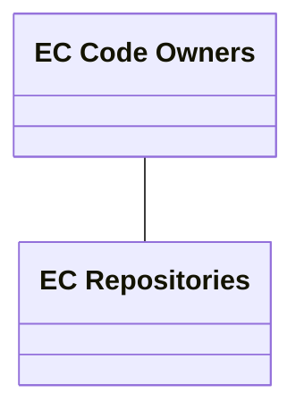
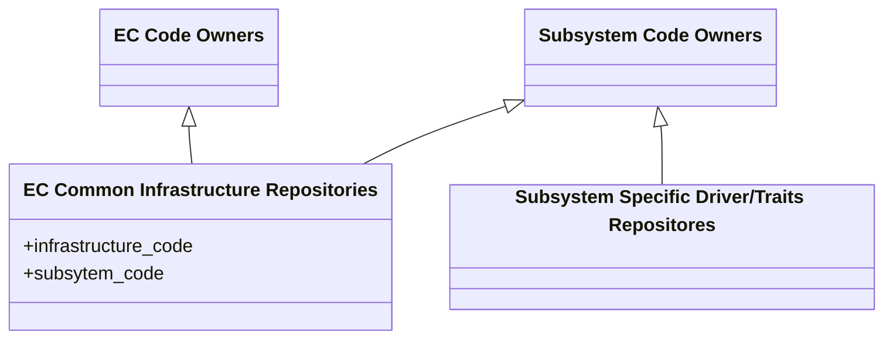

# RFC: `Subsystem Ownership for Embedded Controller (EC) Repositories`

EC repositories currently all list the ec-code-owners team as the [code owner](https://docs.github.com/repositories/managing-your-repositorys-settings-and-features/customizing-your-repository/about-code-owners), and ec-code-owners has write permission to all the EC repositories. The proposal is to create more EC subsystem teams, make these EC subsystem teams code owners of their subsystem code, and give these subsystem teams write permission to the relevant repositories. EC Subsystem teams can also pull in ec-code-owners for code review as needed to get the 2 approvals required.

## Current Ownership Structure

## Proposed Ownership Structure

## Change Log

- 2025-07-28: Initial RFC created
- 2025-07-28: Address Michael's comments

## Motivation

To give EC subsystem teams more autonomy over their code and to make sure a subject matter expert is always pulled-in for review.

## Technology Background

[GitHub Code Owners](https://docs.github.com/repositories/managing-your-repositorys-settings-and-features/customizing-your-repository/about-code-owners)

## Goals

See motivation

## Requirements

Each subsystem should list at least 2 persons.

## Unresolved Questions

- Whether to make all the EC subsystem teams child teams of ec-code-owners, the child teams will inherit the write permission to all EC repositories.
  - Plan to not do so, because making subsystem teams child teams of ec-code-owners would greatly expand the number of people who have write permission. We would prefer that one subsystem team does not have write permission to another subsystem's code as well. The future plan is to allow each subsystem team to have its own team maintainer who can add/remove members (OEM partners, part vendors) to the team as the ecosystem expands.

## Prior Art

Linux kernel maintainer model where each file has a maintainer. Maintainer owns the file and brings in relevant reviewers as needed for PRs.

## Alternatives

Not applicable

## Rust Code Design

Not applicable

## Guide-Level Explanation

Not applicable
